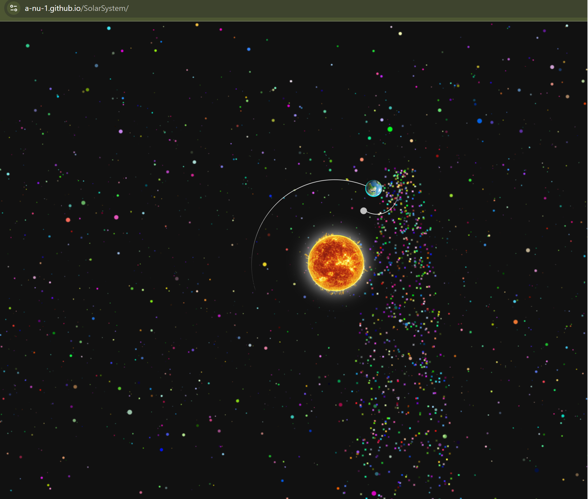

# Solar System

An interactive solar-system visualization built to explore **animation, orbital movement, and browser-based visual effects**.

The project presents the Sun and planets in a visually engaging space environment and focuses on creating motion and interaction using frontend technologies.

🌐 **Live Demo:**  
https://a-nu-1.github.io/SolarSystem/

---

## Screenshot



---

## About This Project

Solar System is a visual frontend project created to experiment with representing planetary movement and space in the browser.

The focus of the project was not only displaying the planets, but creating a more dynamic experience using:

- orbital movement
- animated celestial bodies
- space-inspired visual effects
- relative positioning
- interactive browser rendering

---

## Features

- Animated solar-system visualization
- Sun and planetary bodies
- Orbital movement
- Space-themed background
- Visual motion effects
- Interactive browser experience
- Lightweight frontend implementation

---

## What This Project Demonstrates

This project demonstrates experience with:

- JavaScript
- browser-based animation
- visual UI development
- positioning and movement
- frontend experimentation
- creating interactive visual experiences

---

## Running Locally

### 1. Clone the repository

```bash
git clone https://github.com/A-nu-1/SolarSystem.git
```

### 2. Enter the project directory

```bash
cd SolarSystem
```

### 3. Run the project

Open the project using a local development server or the appropriate script configured in the repository.

For example, if the project uses npm:

```bash
npm install
npm run dev
```

---

## Deployment

The project is hosted using **GitHub Pages**.

Live application:

https://a-nu-1.github.io/SolarSystem/

---

## Possible Future Enhancements

- planet information panels
- selectable planets
- zoom controls
- orbital speed controls
- additional celestial objects
- improved mobile interaction
- educational information about each planet

---

## Author

**Anupama Rajendra**

Software Engineer  
**Java · SQL · Unix / Shell Scripting · Enterprise Integration · Full-Stack · Mobile**

### Links

**Portfolio**  
https://A-nu-1.github.io/anupamaportfolio/

**GitHub**  
https://github.com/A-nu-1

---

## Screenshot File

The screenshot used in this README is stored in the repository root:

- `solar-system.png`

---

## Project Purpose

Solar System is a visual frontend project created to experiment with animation, movement, and interactive browser-based graphics.
